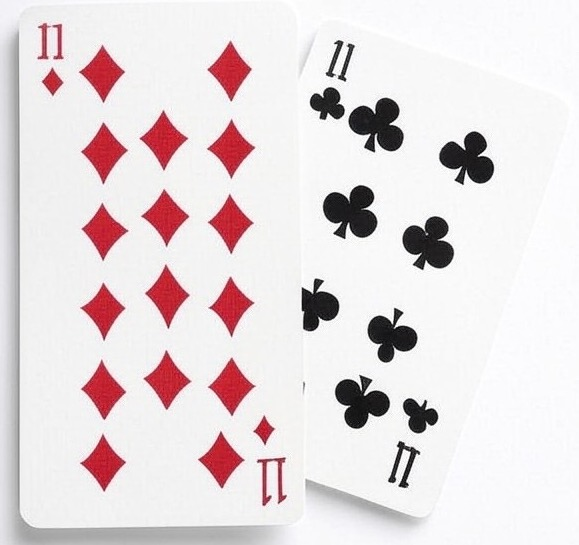

# Go Blackjack ♣️♦️



A command-line implementation of the classic Blackjack card game written in Go. This project is built using a custom-made card deck package ([go-deck](https://github.com/Badara-Senpai/go-deck)), that I created and it provides a flexible and reusable playing card system. The combination of these two packages creates a complete, modular card game framework that can be extended for other card games as well.

## Features

- Classic Blackjack rules implementation
- Support for multiple decks
- Human player interface
- Automated dealer AI following casino rules
- Betting system with configurable Blackjack payout
- Card counting friendly (displays shuffle notifications)
- Built on top of a reusable card deck system

## Game Options

- Multiple decks (default: 3)
- Configurable number of hands (default: 100)
- Adjustable Blackjack payout (default: 1.5)

## Player Actions

- Hit: Draw another card
- Stand: Keep current hand
- Double Down: Double bet and draw one more card

## How to Run

1. Clone both required repositories:
```bash
# Clone the blackjack game
git clone https://github.com/Badara-Senpai/blackjack.git
```

2. Navigate to the project directory:
```bash
cd blackjack
```

3. Run the game:
```bash
go run main.go
```
All dependencies will be automatically downloaded and managed by Go modules.

## Dependencies
- [go-deck](URL_ADDRESS.com/Badara-Senpai/go-deck): Custom-made card deck package
- Go 1.23.4 or higher
